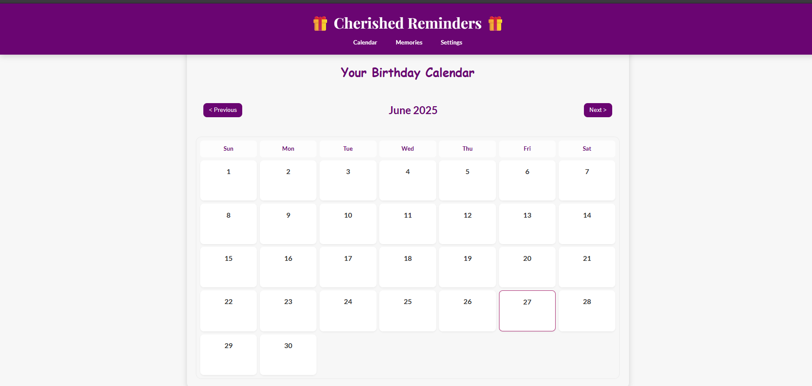
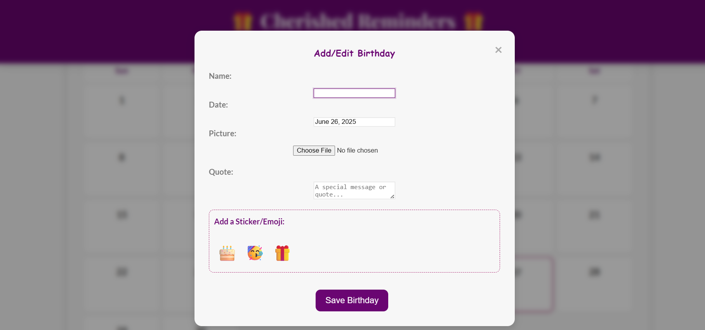
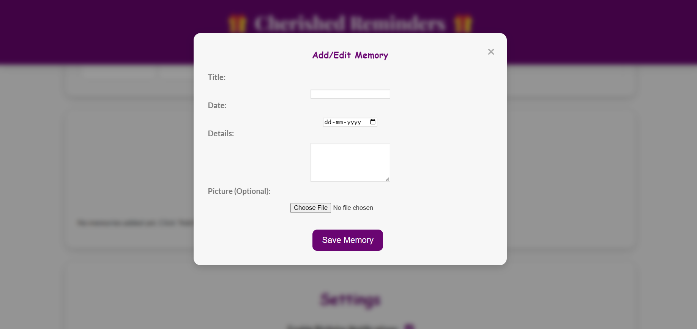

# 🎁 Cherished Reminders 🎁

**A beautiful, interactive, and personal web application designed to help you effortlessly keep track of loved ones' birthdays and special memories.**

---

## ✨ Project Overview

Cherished Reminders is more than just a calendar – it's a digital keepsake. Built with a keen focus on **elegance and user experience**, this application ensures you never miss a special day again. It allows you to:

* **Visually mark important birthdays** on a large, intuitive calendar.
* **Personalize each entry** with a name, date, a cherished photo, a meaningful quote, and even fun stickers/emojis.
* **Capture precious moments** in a dedicated "Memories" diary section, making it easy to revisit happy times.

My goal is to foster deeper connections by simplifying the act of remembering and celebrating.

---

## 📸 Sneak Peek

**Main Calendar View:**


<br> **Adding a New Birthday:**


<br>

**Memories Diary:**



---

## 🚀 Live Demo

Experience Cherished Reminders yourself!
[**Visit the Live Site Here!**](https://moni-tech.github.io/Cherished-Reminders/)

---

## 🌟 Features

* **Interactive Calendar Display:** Easily navigate months and years to view and manage upcoming birthdays.
* **Personalized Birthday Entries:**
    * Add names, birth dates, and set optional notification times.
    * Attach a cherished photo (uploaded from your device) to each birthday.
    * Include a meaningful quote or a personal message to make each entry unique.
    * Decorate entries with charming stickers/emojis for a personal touch.
* **Memory Diary:** A dedicated space to record and revisit special moments, anecdotes, or gifts related to a birthday or any significant event.
* **Intuitive Modals:** Clean and easy-to-use pop-up forms for seamless adding, editing, or deleting of birthday details and memories.
* **Client-Side Notifications:** Receive timely reminders directly in your browser one day before a birthday. (Note: Browser notifications require your explicit permission and the application's tab to be open).
* **Data Persistence:** All your birthdays and memories are securely saved in your browser's local storage, ensuring your data is retained whenever you revisit the site.
* **Elegant & Responsive Design:** Crafted with a sophisticated "Regal Plum & Gold" color palette and refined typography (`Playfair Display` for headings, `Lato` for body text), ensuring a delightful and consistent experience across desktops, tablets, and mobile phones.

---

## 🛠️ Technologies Used

* **HTML5:** Forms the structural backbone and content organization of the application.
* **CSS3:** Provides all the aesthetic styling, including the custom elegant theme, responsive layouts, and subtle animations.
* **JavaScript (ES6+):** Powers all the interactive elements, dynamic calendar generation, data management, notification logic, and form handling, bringing the application to life.
* **Browser Local Storage API:** Utilized for efficient client-side data storage and retrieval, ensuring user data persists across sessions.
* **Google Fonts:** Integrated for beautiful and readable typography, enhancing the overall user interface.

---

## 📦 How to Use (Local Setup for Development)

If you'd like to explore the codebase, contribute, or run the application on your local machine:

1.  **Clone the repository:**
    Open your terminal or Git Bash and run the following command:
    ```bash
    git clone [https://github.com/moni-tech/Cherished-Reminders.git](https://github.com/moni-tech/Cherished-Reminders.git)
    ```
2.  **Navigate to the project directory:**
    ```bash
    cd Cherished-Reminders
    ```
3.  **Open with Live Server (VS Code Extension):**
    * Ensure you have the "Live Server" extension installed in Visual Studio Code.
    * Open the `Cherished-Reminders` folder in VS Code.
    * Right-click on the `index.html` file in your VS Code Explorer sidebar.
    * Select "Open with Live Server" from the context menu. Your default web browser will open the application.

---

## 🙏 Credits

This project was passionately designed and developed by **Monisha Aradhya CM** as a hands-on learning exercise to master web development fundamentals (HTML, CSS, and JavaScript).

* **Contact:** monitech.projects@gmail.com 
* **GitHub Profile:** https://github.com/moni-tech
* **LinkedIn Profile:** : https://lnk.ink/monishaaradhyacm

---
